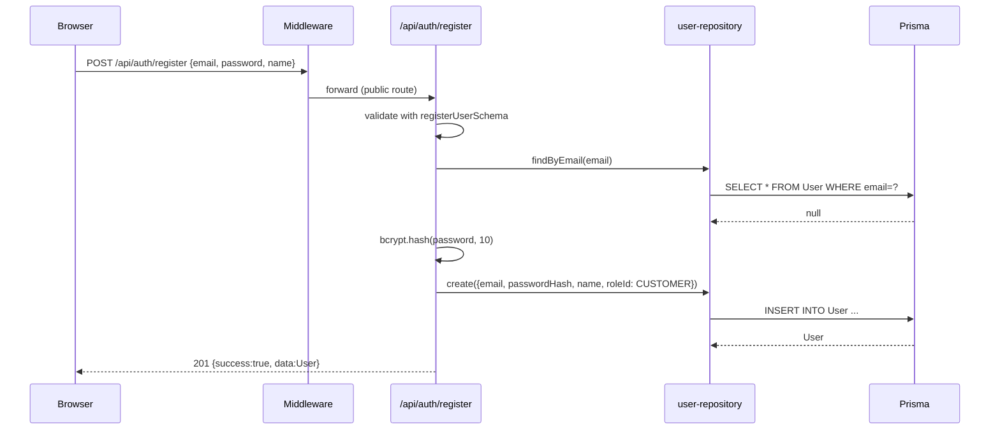
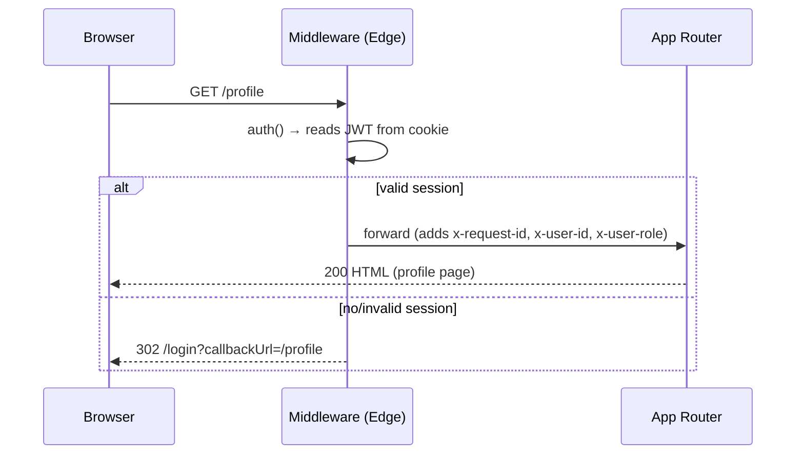
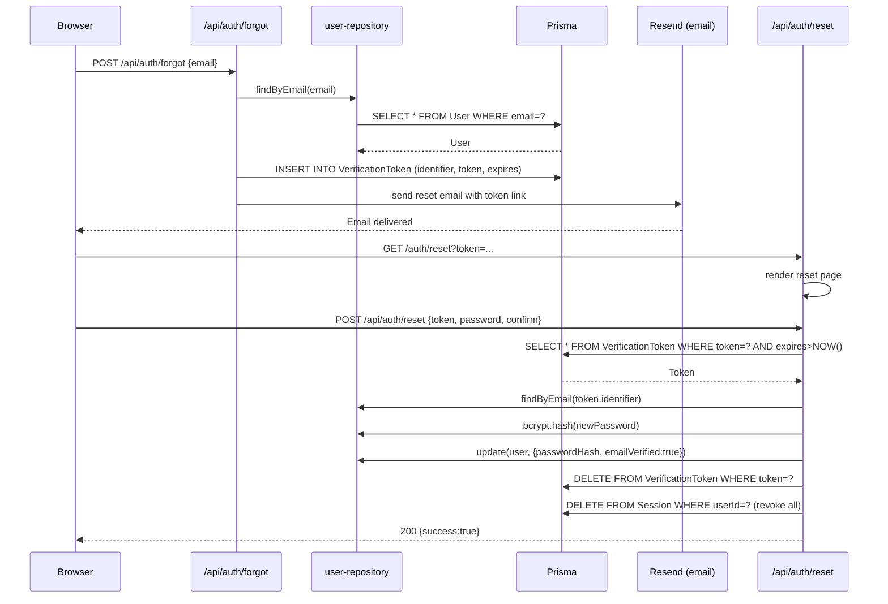
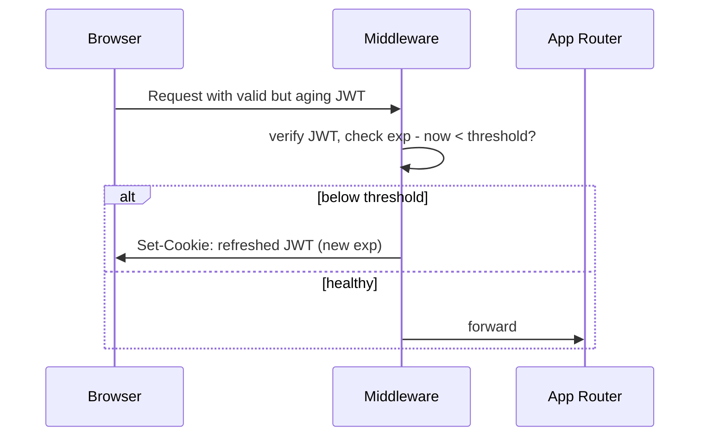

# Document 02 — System Architecture: Authentication & User Management

| Field | Value |
|---|---|
| **Project** | The Kings Hotel — Hospitality Platform |
| **Phase** | Phase 4 — Authentication & User Management |
| **Document status** | Draft for review |
| **Owner** | Engineering |
| **Audience** | Engineering, QA, Security |
| **Depends on** | `01-Product-Overview.md` (D-1, D-2 resolved) |
| **Referenced by** | `03-Database-Design.md`, `04-Authentication.md`, `05-Authorization-RBAC.md`, `06-User-Profile.md`, `07-Security.md`, `08-API-Specification.md`, `09-Frontend-Architecture.md`, `10-UI-Components.md`, `11-Testing.md`, `12-Implementation-Roadmap.md`, `13-Acceptance-Criteria.md` |

**Status legend:** ✅ Implemented · 🚧 Planned

---

## 1. High-Level Architecture

```
┌─────────────────────────────────────────────────────────────────────────────┐
│                           BROWSER (CLIENT)                                  │
│  ┌──────────────┐  ┌──────────────┐  ┌──────────────┐  ┌──────────────┐   │
│  │ Public Pages │  │ Auth Pages   │  │ Profile Page │  │ Staff/Admin  │   │
│  │ (SSR/SSG)    │  │ (Client)     │  │ (Client)     │  │ Console (🚧) │   │
│  └──────┬───────┘  └──────┬───────┘  └──────┬───────┘  └──────┬───────┘   │
└─────────│─────────────────│─────────────────│─────────────────│────────────┘
          │                 │                 │                 │
          ▼                 ▼                 ▼                 ▼
┌─────────────────────────────────────────────────────────────────────────────┐
│                        VERCEL EDGE NETWORK (CDN)                            │
│  ┌─────────────────────────────────────────────────────────────────────┐   │
│  │                    EDGE MIDDLEWARE (86.7 kB)                        │   │
│  │  • Validates JWT session cookie (no Prisma, no bcrypt)              │   │
│  │  • Redirects unauthenticated page requests to /login                │   │
│  │  • Returns 401 JSON for protected API routes                        │   │
│  │  • Injects x-request-id for correlation                             │   │
│  └─────────────────────────────────────────────────────────────────────┘   │
└────────────────────────────────┬──────────────────────────────────────────┘
                                 │
                                 ▼
┌─────────────────────────────────────────────────────────────────────────────┐
│                        NEXT.JS 15.5 (APP ROUTER)                            │
│  ┌──────────────────┐  ┌──────────────────┐  ┌──────────────────────────┐  │
│  │  Public Routes   │  │  Auth Routes     │  │  Protected API Routes    │  │
│  │  (SSG/SSR)       │  │  (Server/Client) │  │  (force-dynamic)         │  │
│  │  ──────────────  │  │  ──────────────  │  │  ─────────────────────   │  │
│  │  /               │  │  /login          │  │  /api/auth/*             │  │
│  │  /rooms          │  │  /register       │  │  /api/profile            │  │
│  │  /experience     │  │  /profile        │  │  /api/users              │  │
│  │  ...             │  │                  │  │  /api/bookings* (🚧)     │  │
│  └──────────────────┘  └──────────────────┘  └──────────────────────────┘  │
│                                                                             │
│  ┌─────────────────────────────────────────────────────────────────────┐   │
│  │                      AUTH.JS V5 CORE                                │   │
│  │  ┌──────────┐  ┌─────────────┐  ┌─────────┐  ┌─────────────────┐   │   │
│  │  │ config   │  │ credentials │  │  edge   │  │  index (full)   │   │   │
│  │  │ (shared) │  │  provider   │  │ (MW)    │  │  (Node runtime) │   │   │
│  │  └──────────┘  └─────────────┘  └─────────┘  └─────────────────┘   │   │
│  │         │            │            │              │                  │   │
│  │         └────────────┴────────────┴──────────────┘                  │   │
│  │                          │                                           │   │
│  │               ┌──────────▼──────────┐                                │   │
│  │               │   Session Store     │                                │   │
│  │               │   (JWT in cookie)   │                                │   │
│  │               └─────────────────────┘                                │   │
│  └─────────────────────────────────────────────────────────────────────┘   │
│                                                                             │
│  ┌─────────────────────────────────────────────────────────────────────┐   │
│  │                     SERVICE / REPOSITORY LAYER                       │   │
│  │  ┌──────────────┐  ┌──────────────┐  ┌──────────────┐              │   │
│  │  │auth-service  │  │user-service  │  │profile-service             │  │
│  │  └──────┬───────┘  └──────┬───────┘  └──────┬───────┘              │   │
│  │         │                 │                 │                      │   │
│  │  ┌──────▼───────┐  ┌──────▼───────┐  ┌──────▼───────┐              │   │
│  │  │user-repo     │  │role-repo     │  │...           │              │   │
│  │  └──────┬───────┘  └──────┬───────┘  └──────┬───────┘              │   │
│  └─────────│─────────────────│─────────────────│───────────────────────┘   │
└────────────│─────────────────│─────────────────│───────────────────────────┘
             │                 │                 │
             ▼                 ▼                 ▼
┌─────────────────────────────────────────────────────────────────────────────┐
│                          PRISMA CLIENT (v5.19)                              │
│  ┌──────────┐  ┌──────────┐  ┌──────────┐  ┌──────────┐  ┌──────────┐     │
│  │  User    │  │  Role    │  │ Account  │  │ Session  │  │Verification│     │
│  │          │  │          │  │          │  │          │  │  Token   │     │
│  └──────────┘  └──────────┘  └──────────┘  └──────────┘  └──────────┘     │
│  ┌──────────┐  ┌──────────┐  ┌──────────┐  ┌──────────┐  ┌──────────┐     │
│  │  Staff   │  │ AuditLog │  │Notification│  │ ...      │  │          │     │
│  └──────────┘  └──────────┘  └──────────┘  └──────────┘  └──────────┘     │
└────────────────────────────────────┬────────────────────────────────────────┘
                                     │
                                     ▼
┌─────────────────────────────────────────────────────────────────────────────┐
│                      POSTGRESQL (NEON-COMPATIBLE)                           │
│  Tables: User, Role, Account, Session, VerificationToken, Staff,            │
│          AuditLog, Notification, + domain tables (Booking, Room, ...)       │
└─────────────────────────────────────────────────────────────────────────────┘
```

---

## 2. Request Lifecycle

### 2.1 Public page request (e.g., `/rooms`)

```
Browser → Edge CDN → Middleware (session cookie read, no redirect) → 
Next.js App Router → Static/Server-rendered page → Browser
```

### 2.2 Protected page request (e.g., `/profile`)

```
Browser → Edge CDN → Middleware:
  ├─ Has valid JWT? → Yes → Pass to Next.js (adds x-request-id)
  └─ No            → 302 Redirect to /login?callbackUrl=/profile
```

### 2.3 Protected API request (e.g., `GET /api/profile`)

```
Browser → Edge CDN → Middleware:
  ├─ Has valid JWT? → Yes → Forward to API handler (adds x-request-id)
  └─ No            → 401 JSON {success:false, error:"Unauthorized", code:"UNAUTHORIZED"}
```

### 2.4 Auth API request (e.g., `POST /api/auth/login`)

```
Browser → Next.js → NextAuth handler (/api/auth/[...nextauth]) → 
Credentials provider → user-repository → bcrypt compare → 
JWT callback → Session cookie set → 200 JSON
```

---

## 3. Auth.js v5 Integration

### 3.1 Split-module architecture (edge-safe)

`src/lib/auth/`:

```
config.ts       → Shared config (callbacks, pages, secret, JWT strategy) — NO providers/adapter
edge.ts         → NextAuth(config) → used by src/middleware.ts (Edge runtime, 86.7 kB)
credentials.ts  → Credentials provider (authorize → user-repository + bcrypt compare)
index.ts        → Full runtime: {handlers, auth, signIn, signOut} + providers + Prisma adapter
roles.ts        → RBAC helpers (isAdmin, isStaff, requireRole, etc.)
session.ts      → Session helpers (authenticated, currentUser, requireAuth, requireSelfOrAdmin)
```

**Why this split:** The middleware must run on the Edge (no Prisma, no bcrypt). `config.ts` contains only the Auth.js configuration object — no side effects, no Node-only deps. `edge.ts` imports only `config.ts` and exports the Edge-safe `NextAuth` instance. `index.ts` imports everything (providers, adapter, Prisma) and runs in the Node runtime (API routes, server components).

### 3.2 Configuration (`config.ts`)

```typescript
// Key settings (actual code)
export const authConfig = {
  strategy: "jwt",                    // Stateless sessions
  session: { maxAge: 60 * 60 * 24 * 30 }, // 30 days
  pages: {
    signIn: "/login",
    error: "/login",                  // Error page shows inlined error
  },
  callbacks: {
    async jwt({ token, user, trigger, session }) { ... }, // role embedding
    async session({ session, token }) { ... },           // token → session.user
  },
  secret: process.env.NEXTAUTH_SECRET,
  // providers: [] — intentionally empty; added in index.ts
};
```

### 3.3 Credentials provider (`credentials.ts`)

```typescript
// Flow
authorize(credentials) →
  userRepository.findByEmail(credentials.email) →
  if (!user || !user.passwordHash) return null
  bcrypt.compare(credentials.password, user.passwordHash) →
  if (!valid) return null
  return { id, email, name, role, image } // embedded into JWT
```

### 3.4 JWT token contents

Signed JWT cookie (`next-auth.session-token`) contains:

```json
{
  "sub": "uuid",
  "email": "user@example.com",
  "name": "Full Name",
  "image": "https://...",
  "role": "CUSTOMER",
  "iat": 1699999999,
  "exp": 1702591999,
  "jti": "..."
}
```

Only non-sensitive claims are stored. The token is signed with `NEXTAUTH_SECRET` (HS256 by default).

### 3.5 Session helpers (`session.ts`)

| Helper | Returns | Throws |
|---|---|---|
| `authenticated()` | `boolean` | Never |
| `currentUser()` | `SessionUser \| null` | Never |
| `requireAuth()` | `SessionUser` | `UnauthorizedError` (401) |
| `requireSelfOrAdmin(userId)` | `SessionUser` | `UnauthorizedError` (401/403) |

`SessionUser` shape (exported, matches JWT + augmentation):

```typescript
interface SessionUser {
  id: string;
  email: string;
  name: string;
  image?: string | null;
  role?: string; // UserRole enum value
}
```

---

## 4. Session & Token Lifecycle

### 4.1 Login → JWT issuance

1. `POST /api/auth/login` → NextAuth credentials flow.
2. `credentials.authorize()` validates email+password.
3. On success, JWT callback receives `user` → embeds `role` into token.
4. Auth.js sets `next-auth.session-token` cookie (HttpOnly, Secure, SameSite=Lax, Path=/).
5. Response: 200 `{success: true, data: {user: SessionUser}}`.

### 4.2 Session access (per request)

- **Middleware (Edge):** Reads & verifies JWT from cookie using `jose` (no Prisma). Extracts `role`, `sub` for route decisions.
- **Server components / API routes:** Call `auth()` (from `src/lib/auth/index.ts`) → returns typed `Session` → `session.user` has `id`, `email`, `name`, `image`, `role`.

### 4.3 Token refresh

- JWT strategy = no automatic server-side refresh. Session lifetime = 30 days (`maxAge`).
- On each request, if token is valid, it's accepted.
- For extended sessions, user must re-login (future: sliding window refresh token).

### 4.4 Logout

`POST /api/auth/logout` → NextAuth `signOut()` → clears session cookie → 200 `{success: true}`.

### 4.5 Logout everywhere (🚧 planned)

`POST /api/auth/logout-all` → delete all `Session` rows for user (adapter) + clear current cookie.

### 4.6 Token invalidation on password change (🚧 planned)

On `PATCH /api/profile` with `currentPassword` + `newPassword`:
1. Rehash password.
2. Invalidate all user sessions (`Session` rows) via adapter.
3. Clear current cookie → force re-login.

---

## 5. RBAC & Permission Evaluation Flow

### 5.1 Data model (source of truth)

```
Role (id, name: UserRole, permissions: String[])
  │
  └─ User (roleId → Role)
```

- `permissions` is a `String[]` (e.g., `["bookings:create", "bookings:read:own"]`).
- `ADMIN` and `SUPER_ADMIN` get `["*"]` (wildcard).

### 5.2 Compile-time guards (`roles.ts`)

```typescript
// Current implementation — static sets derived from enum
const staffRoles = new Set([STAFF, MANAGER, CONCIERGE, ADMIN]);
const adminRoles = new Set([ADMIN, MANAGER]);

// After D-1 migration:
const adminRoles = new Set([SUPER_ADMIN, ADMIN, MANAGER]);
const staffRoles = new Set([SUPER_ADMIN, ADMIN, MANAGER, STAFF]);
```

**Limitation:** These are hard-coded approximations. The true source is `Role.permissions`.

### 5.3 Evaluation pipeline (runtime)

```
Request
  │
  ├─ Middleware: validates JWT, extracts role, enforces route-level access
  │
  ├─ API handler: requireAuth() / requireRole(...) / requireAdmin()
  │     │
  │     └─ throws ForbiddenError (403) if check fails
  │
  ├─ Server component: same guards before rendering
  │
  └─ Client component: receives `canX` props computed server-side
```

### 5.4 Permission check (future convergent model, Document 05)

```typescript
async function can(user: SessionUser, permission: string): Promise<boolean> {
  if (user.role === "SUPER_ADMIN") return true; // wildcard
  const role = await roleRepository.findByName(user.role);
  if (!role) return false;
  return role.permissions.includes("*") || role.permissions.includes(permission);
}
```

**Middleware vs API vs Component:**

| Layer | What it checks | Latency |
|---|---|---|
| Middleware | Route-level (public vs protected) | ~1 ms (Edge, JWT only) |
| API guard | `requireAuth()` + `requireRole(...)` | ~5 ms (requires `auth()`) |
| Server component | Same guards | ~5 ms |
| Client component | Pre-computed `canX` props | 0 ms (client) |

---

## 6. Middleware Architecture

### 6.1 File: `src/middleware.ts`

```typescript
// Runs on every request (Edge)
export async function middleware(request: NextRequest) {
  const response = NextResponse.next();
  response.headers.set("x-request-id", crypto.randomUUID());

  const session = await auth(); // src/lib/auth/edge.ts (Edge-safe)

  // Protected page patterns
  const protectedPages = ["/profile", "/dashboard", "/admin"];
  // Protected API patterns
  const protectedApis = ["/api/profile", "/api/users", "/api/bookings"];

  const isProtectedPage = protectedPages.some(p => request.nextUrl.pathname.startsWith(p));
  const isProtectedApi = protectedApis.some(p => request.nextUrl.pathname.startsWith(p));

  if (!session?.user) {
    if (isProtectedPage) {
      return NextResponse.redirect(new URL(`/login?callbackUrl=${request.nextUrl.pathname}`, request.url));
    }
    if (isProtectedApi) {
      return NextResponse.json(
        { success: false, error: "Unauthorized", code: "UNAUTHORIZED" },
        { status: 401, headers: { "x-request-id": response.headers.get("x-request-id")! } }
      );
    }
  }

  // Optional: add user context to headers for downstream logging
  if (session?.user) {
    response.headers.set("x-user-id", session.user.id);
    response.headers.set("x-user-role", session.user.role || "");
  }

  return response;
}

export const config = {
  matcher: ["/((?!_next/static|_next/image|favicon.ico|robots.txt|sitemap.xml).*)"],
};
```

### 6.2 Edge constraints

- **No Prisma, no bcrypt, no Node crypto** — bundle is 86.7 kB.
- Uses `jose` (bundled by Auth.js) for JWT verification.
- Only `authConfig` (shared) is imported.

### 6.3 Request ID correlation

Every response gets `x-request-id` (UUID v4). API error responses echo it. Logs include it.

---

## 7. Route Protection Strategy

### 7.1 Public routes (no auth required)

- All `(public)` group pages: `/`, `/rooms`, `/rooms/[id]`, `/experience/*`, `/services`, `/about`, `/contact`, `/testimonials`
- Auth pages: `/login`, `/register`
- API: `/api/auth/*`, `/api/health`, `/api/rooms` (list), `/api/rooms/[id]`, `/api/restaurant/menu*`, `/api/reviews` (GET), `/api/contact`

### 7.2 Protected pages (redirect to `/login`)

| Path | Required role |
|---|---|
| `/profile` | Any authenticated |
| `/dashboard` (🚧) | `CUSTOMER` |
| `/staff/*` (🚧) | `STAFF` |
| `/manager/*` (🚧) | `MANAGER` |
| `/admin/*` (🚧) | `ADMIN` |
| `/super-admin/*` (🚧) | `SUPER_ADMIN` |

### 7.3 Protected APIs (401 JSON)

| Path | Required role |
|---|---|
| `/api/profile` | Any authenticated |
| `/api/users` (GET) | `ADMIN`/`MANAGER` |
| `/api/users/[id]` (GET/PATCH/DELETE) | Self or `ADMIN`/`MANAGER` |
| `/api/bookings/*` (🚧) | `CUSTOMER`/`STAFF`/... per action |
| `/api/payments/*` (🚧) | `MANAGER`/`ADMIN` |

### 7.4 Route group structure

```
src/app/
├── (public)/          # No auth required
├── (auth)/            # Login, register, profile (auth checked in page)
├── (dashboard)/       # 🚧 Customer dashboard
├── (staff)/           # 🚧 Staff console
├── (manager)/         # 🚧 Manager console
├── (admin)/           # 🚧 Admin console
└── api/               # Route handlers (own guards)
```

---

## 8. API Authentication & Authorization

### 8.1 Envelope format (all handlers)

```typescript
// Success
{ success: true, data: T, message?: string }

// Error (thrown by withErrorHandler)
{ success: false, error: string, code: string }
```

### 8.2 Error taxonomy (`src/lib/errors/`)

| Class | HTTP | Code | When |
|---|---|---|---|
| `ValidationError` | 422 | `VALIDATION_ERROR` | Zod parse failure |
| `UnauthorizedError` | 401 | `UNAUTHORIZED` | No session / invalid JWT |
| `ForbiddenError` | 403 | `FORBIDDEN` | Role/permission mismatch |
| `NotFoundError` | 404 | `NOT_FOUND` | Entity missing |
| `ConflictError` | 409 | `CONFLICT` | Unique constraint (email) |
| `NotImplementedError` | 501 | `NOT_IMPLEMENTED` | Stubbed business logic |

### 8.3 Middleware stack per route

```
withErrorHandler(
  withValidation(schema)(   // optional — for body validation
    async (request, validatedData, ...rest) => {
      // handler logic
    }
  )
)
```

`withValidation` parses JSON body, runs `schema.safeParse`, throws `ValidationError` on failure.

### 8.4 Example: `PATCH /api/profile`

```typescript
// src/app/api/profile/route.ts
export const PATCH = withErrorHandler(
  withValidation(updateProfileSchema)(
    async (request, data, context) => {
      const user = await requireAuth();          // 401 if no session
      await requireSelfOrAdmin(user.id);         // 403 if not self and not ADMIN/MANAGER
      const updated = await profileService.update(user.id, data);
      return jsonOk(updated);
    }
  )
);
```

### 8.5 Example: `GET /api/users` (admin)

```typescript
export const GET = withErrorHandler(
  async () => {
    await requireAdmin();                         // 401/403 if not ADMIN/MANAGER
    const users = await userService.list();
    return jsonOk(users);
  }
);
```

---

## 9. Folder / Module Architecture

### 9.1 `src/lib/auth/` (core)

| File | Responsibility | Runtime |
|---|---|---|
| `config.ts` | Auth.js config object (callbacks, pages, secret, JWT strategy) | Edge + Node |
| `edge.ts` | `NextAuth(config)` — used by `middleware.ts` | Edge only |
| `credentials.ts` | Credentials provider (`authorize` → user repo + bcrypt) | Node |
| `index.ts` | Full runtime: `{handlers, auth, signIn, signOut}` + providers + Prisma adapter | Node |
| `roles.ts` | RBAC helpers (`isAdmin`, `requireRole`, etc.) | Node |
| `session.ts` | Session helpers (`authenticated`, `requireAuth`, etc.) | Node |

### 9.2 `src/lib/repositories/` (data access)

| File | Exports |
|---|---|
| `user-repository.ts` | `findById`, `findByEmail`, `create`, `update`, `list` |
| `role-repository.ts` | `findByName`, `findById`, `list`, `upsertPermissions` |
| `index.ts` | Barrel export |

### 9.3 `src/lib/services/` (business logic)

| File | Exports |
|---|---|
| `auth-service.ts` | `register`, `login` (delegates to NextAuth internally), `logout` |
| `user-service.ts` | `list`, `getById`, `updateRole`, `deactivate` |
| `profile-service.ts` | `update`, `changePassword` |
| `index.ts` | Barrel export |

### 9.4 `src/lib/validations/` (schemas)

| File | Key schemas |
|---|---|
| `user.ts` | `registerUserSchema`, `createUserSchema`, `loginSchema`, `updateProfileSchema`, `updateUserSchema`, `changePasswordSchema` |
| `common.ts` | `idParamSchema`, `paginationSchema`, `dateRangeSchema` |
| `review.ts` | `createReviewSchema`, `moderateReviewSchema` |
| `booking.ts` | `createBookingSchema`, `updateBookingSchema`, `bookingQuerySchema` |
| ... | (other domains) |

### 9.5 `src/lib/errors/` (typed errors)

`ApiError` (base) → `ValidationError`, `UnauthorizedError`, `ForbiddenError`, `NotFoundError`, `ConflictError`, `NotImplementedError`.

### 9.6 `src/lib/middleware/` (route helpers)

| File | Export |
|---|---|
| `with-error-handler.ts` | `withErrorHandler` (uniform envelope) |
| `with-validation.ts` | `withValidation(schema)` (body validation) |

### 9.7 `src/types/next-auth.d.ts`

Augments `next-auth` `Session` and `JWT` to include `id` and `role`.

---

## 10. Security Layers

| Layer | Mechanism | Implemented |
|---|---|---|
| Transport | HTTPS (Vercel) + HSTS | ✅ |
| Cookies | HttpOnly + Secure + SameSite (Auth.js) | ✅ |
| Password | bcryptjs cost 10 | ✅ |
| CSRF | Auth.js built-in + SameSite cookie | ✅ |
| XSS | React auto-escape, no `dangerouslySetInnerHTML` in auth | ✅ |
| SQLi | Prisma parameterized queries only | ✅ |
| Input validation | Zod at API boundary (`withValidation`) | ✅ |
| Rate limiting | 🚧 (planned: `/api/auth/login`, `/api/auth/register`, `/api/auth/forgot`) |
| Audit logging | `AuditLog` model exists; wiring 🚧 |
| Session revocation | 🚧 (on password change, logout-all) |
| MFA | 🚧 (planned: TOTP via `otplib`) |

---

## 11. Sequence Diagrams

### 11.1 Registration



### 11.2 Login

```mermaid
sequenceDiagram
    participant B as Browser
    participant N as NextAuth (/api/auth/[...nextauth])
    participant CP as Credentials Provider
    participant R as user-repository
    participant P as Prisma

    B->>N: POST /api/auth/login {email, password}
    N->>CP: authorize({email, password})
    CP->>R: findByEmail(email)
    R->>P: SELECT * FROM User WHERE email=?
    P-->>R: User
    CP->>CP: bcrypt.compare(password, passwordHash)
    alt valid
        CP-->>N: {id, email, name, role}
        N->>N: JWT callback → embed role
        N->>B: Set-Cookie: next-auth.session-token=...; 200 {user}
    else invalid
        CP-->>N: null
        N-->>B: 401 {error:"Invalid credentials", code:"UNAUTHORIZED"}
    end
```

### 11.3 Logout

```mermaid
sequenceDiagram
    participant B as Browser
    participant N as NextAuth
    B->>N: POST /api/auth/logout
    N->>N: signOut()
    N-->>B: Clear Cookie; 200 {success:true}
```

### 11.4 Protected page access



### 11.5 Password reset (🚧 planned)



### 11.6 Session refresh (🚧 planned sliding window)



---

## 12. Database Interaction Flow

### 12.1 User registration

```
POST /api/auth/register
  → validate schema
  → userRepository.findByEmail (SELECT)
  → bcrypt.hash
  → userRepository.create (INSERT User + Role relation)
  → return User (no passwordHash)
```

### 12.2 Credentials login

```
NextAuth authorize
  → userRepository.findByEmail (SELECT)
  → bcrypt.compare
  → return user object (id, email, name, role)
```

### 12.3 Protected API (e.g., `GET /api/profile`)

```
middleware → auth() → JWT verify (no DB)
  → requireAuth() → auth() again (cached per-request)
  → profileService.getById (SELECT User + Role)
  → return
```

### 12.4 Role/permission check (future)

```
requireRole("ADMIN")
  → requireAuth() → get session user
  → roleRepository.findByName(user.role) (SELECT)
  → check permissions array
```

---

## 13. Error-Handling Architecture

```
try {
  // route handler body
} catch (err) {
  if (err instanceof ApiError) {
    return NextResponse.json(
      { success: false, error: err.message, code: err.code },
      { status: err.statusCode }
    );
  }
  // Unknown error → 500
  console.error(err);
  return NextResponse.json(
    { success: false, error: "Internal server error", code: "INTERNAL_ERROR" },
    { status: 500 }
  );
}
```

- All handlers wrapped with `withErrorHandler` (uniform envelope).
- Validation errors → `ValidationError` (422) from `withValidation`.
- Auth errors → `UnauthorizedError` (401) from `requireAuth` or middleware.
- Authorization errors → `ForbiddenError` (403) from `requireRole`/`requireAdmin`.
- Not found → `NotFoundError` (404) from repositories.
- Conflicts → `ConflictError` (409) from unique constraints (email).
- Stubs → `NotImplementedError` (501) for unimplemented business logic.

---

## 14. Caching & Performance

| Concern | Approach |
|---|---|
| JWT verification (middleware) | `jose` native, no DB, ~1 ms |
| `auth()` call caching | Next.js caches `auth()` per request; multiple calls return same promise |
| bcrypt cost | 10 (tuned: ~50–100 ms on modern CPU) |
| Session cookie size | ~300 bytes (only id, email, name, image, role) |
| Prisma connection pool | Default; configure `connection_limit` for Neon serverless |
| Rate limiting (🚧) | Planned: in-memory (Vercel) + Redis (multi-instance) |
| CDN | Static pages pre-rendered; auth pages dynamic (`force-dynamic`) |

---

## 15. Extension Points (Future-Proofing)

| Feature | Prep work done | Remaining |
|---|---|---|
| OAuth (Google, GitHub, etc.) | `Account`, `Session`, `VerificationToken` tables; `@auth/prisma-adapter` installed | Add providers to `index.ts`; configure callback URLs; handle account linking |
| MFA (TOTP) | `User` has `totpSecret?` field? (🚧 add) | Add `totpSecret`, `totpEnabled`; `POST /api/auth/mfa/enable`, verify on login |
| Multi-tenant (hotel branches) | `User` has single `roleId`; `Role` is global | Add `Hotel` model, `User.hotelId`, branch-scoped roles/permissions |
| SSO / SAML | Auth.js supports SAML via `next-auth-saml` | Add provider; configure IdP metadata |
| Passkeys / WebAuthn | None | Add `WebAuthnCredential` model; integrate with `@simplewebauthn/server` |
| Device trust / session management | `Session` table exists | UI for "my devices"; `logout-all`; suspicious login alerts |
| Fine-grained audit | `AuditLog` model exists | Write helpers in `auth-service`, `user-service`; middleware enrichment |

---

## 16. Summary of Implemented vs Planned

| Area | ✅ Implemented | 🚧 Planned (Phase 4 remainder) |
|---|---|---|
| Auth.js integration | Split modules, credentials, JWT, middleware | OAuth providers, MFA |
| Session | JWT cookie, 30-day expiry | Sliding refresh, logout-all, device list |
| RBAC core | Roles table, permissions array, guards (`isAdmin`, `requireRole`, etc.) | Convergent permission checks (data-driven), UI for role mgmt |
| Route protection | Middleware (page redirect / API 401), protected API guards | Staff/manager/admin route groups + consoles |
| User profile | GET/PUT `/api/profile`, `/profile` page | Password change, avatar (Cloudinary), email change |
| Security | bcrypt, HttpOnly cookies, Zod validation, typed errors | Rate limiting, audit logging, session revocation |
| Seed/admin | 5 roles + admin user | SUPER_ADMIN seed, permission catalog per specialization |

---

*End of Document 02. Next: `03-Database-Design.md`.*