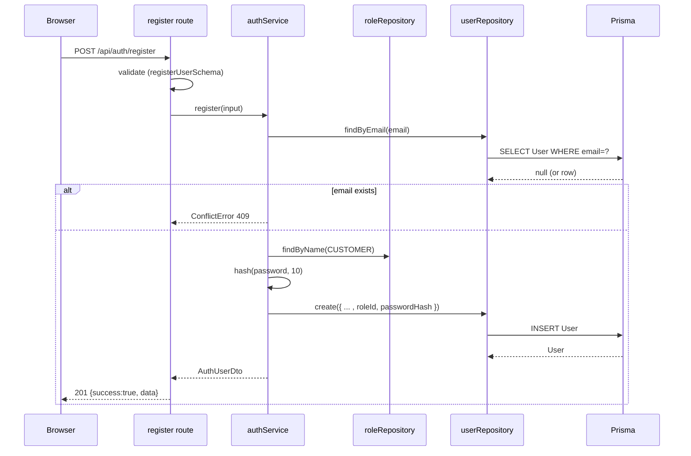
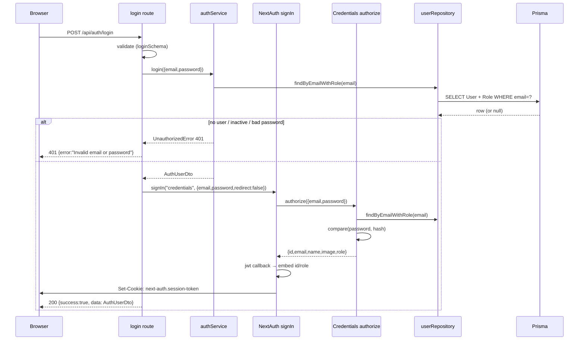

# Document 04 — Authentication

| Field | Value |
|---|---|
| **Project** | The Kings Hotel — Hospitality Platform |
| **Phase** | Phase 4 — Authentication & User Management |
| **Document status** | Draft for review |
| **Owner** | Engineering |
| **Audience** | Engineering, QA, Security |
| **Source of truth** | `src/lib/auth/` (config, credentials, edge, index, session, roles), `src/app/api/auth/*`, `src/middleware.ts`, `src/lib/services/auth-service.ts`, `src/lib/repositories/user-repository.ts`, `src/lib/validations/user.ts`, `src/types/next-auth.d.ts` |
| **Depends on** | `02-System-Architecture.md`, `03-Database-Design.md` |
| **Referenced by** | `07-Security.md`, `08-API-Specification.md`, `11-Testing.md` |

**Status legend:** ✅ Implemented · 🚧 Planned

---

## 1. Approach

Authentication uses **Auth.js (NextAuth v5, `5.0.0-beta.32`)** with a **JWT session strategy**, a **credentials provider**, and a **Prisma adapter** (`@auth/prisma-adapter`). The integration is split into edge-safe and Node-runtime modules so the Edge middleware stays free of Prisma and bcrypt (bundle: 86.7 kB).

```
┌───────────────────────────┐
│   src/lib/auth/config.ts  │  shared config (no providers/adapter)
└───────────┬───────────────┘
            │
    ┌───────┴───────┐
    │               │
┌───▼───┐      ┌────▼─────┐
│edge.ts│      │ index.ts │  + credentials.ts + PrismaAdapter
│ (Edge)│      │ (Node)   │
└───┬───┘      └────┬─────┘
    │               │
src/middleware.ts   app/api/auth/[...nextauth] + routes
```

---

## 2. Implemented Flows (✅)

### 2.1 Registration — `POST /api/auth/register`

**Files:** `src/app/api/auth/register/route.ts`, `authService.register`, `roleRepository.findByName`, `userRepository.create`

**Request body (validated by `registerUserSchema`):**
```json
{
  "firstName": "John",
  "lastName": "Doe",
  "email": "john@example.com",
  "phone": "+2348012345678",       // optional
  "password": "SecurePass123",
  "confirmPassword": "SecurePass123"
}
```

**Validation rules (`registerUserSchema`):**
- `firstName`, `lastName`: trimmed, 1–60 chars.
- `email`: valid email, lowercased via `.toLowerCase()`.
- `phone`: 7–20 chars, optional.
- `password`: 8–128 chars, must contain a lowercase letter, an uppercase letter, and a digit.
- `confirmPassword` must equal `password` (refine rule).

**Service logic (`authService.register`):**
1. `userRepository.findByEmail(email)` → if exists, **409 `ConflictError`**.
2. `roleRepository.findByName("CUSTOMER")` → if missing, **404** ("Default role is not configured").
3. `hash(password, 10)` (bcryptjs).
4. `userRepository.create({ firstName, lastName, name: "First Last", email, phone, passwordHash, roleId })`.
5. Returns `AuthUserDto` (id, firstName, lastName, name, email, image, role) — **never** the password hash.

**Response:** `201` `{ success: true, data: AuthUserDto, message: "Account created" }`

**Notes / gaps:**
- New users get `emailVerified: false` by default (schema default). Email-verification flow is 🚧 (§3.1).
- No session is established at registration — the user must log in separately (product decision; revisit if friction matters).

**Sequence:**


---

### 2.2 Login — `POST /api/auth/login`

**Files:** `src/app/api/auth/login/route.ts`, `authService.login`, `credentialsProvider.authorize`, `signIn`

**Request body (validated by `loginSchema`):**
```json
{ "email": "john@example.com", "password": "SecurePass123" }
```

**Service logic (`authService.login`):**
1. `userRepository.findByEmailWithRole(email)` → includes `role` relation.
2. If no user **or** `!user.isActive` → **401 `UnauthorizedError`** ("Invalid email or password").
3. `bcrypt.compare(password, passwordHash)` → if invalid → **401** (same generic message — no user enumeration).
4. Returns `AuthUserDto` (role from `user.role.name`).

**Route logic:**
- After `authService.login` succeeds, the route calls `signIn("credentials", { email, password, redirect: false })` to mint the session cookie via the Auth.js flow.
- Response: `200` `{ success: true, data: AuthUserDto, message: "Signed in" }`.

**Note:** `authService.login` pre-validates credentials so the sign-in call is a formality for the cookie; invalid credentials fail fast with a typed 401 rather than an Auth.js `AuthError` (which would otherwise surface as a generic 5xx).

**Session establishment (Auth.js credentials flow):**
1. `authorize(credentials)` in `credentials.ts`:
   - `userRepository.findByEmailWithRole(email)`.
   - Reject `!user || !user.isActive` → `null`.
   - `compare(password, passwordHash)` → `null` on mismatch.
   - Return `{ id, email, name, image, role: user.role.name }`.
2. `jwt` callback (`config.ts`) embeds `token.id = user.id`, `token.role = user.role` when a user object is present.
3. `session` callback maps `session.user.id = token.id`, `session.user.role = token.role`.
4. Auth.js sets `next-auth.session-token` cookie (HttpOnly, Secure, SameSite=Lax, Path=/).

**Sequence:**


---

### 2.3 Logout — `POST /api/auth/logout`

**Files:** `src/app/api/auth/logout/route.ts`, `authService.logout`

- `authService.logout()` → `signOut({ redirect: false })` (full runtime instance).
- Auth.js clears the `next-auth.session-token` cookie.
- Response: `204 No Content` (`jsonNoContent`).

**Gaps (🚧):**
- No server-side session revocation (JWT strategy — the token remains valid until expiry unless cookie is cleared).
- "Logout everywhere" / device list (§3.5).
- Audit log entry for logout (§3.7).

---

### 2.4 Current user — `GET /api/auth/me`

**Files:** `src/app/api/auth/me/route.ts`, `authService.getCurrentUser`

1. `requireAuth()` — reads session; throws 401 if absent.
2. `userRepository.findByIdWithRole(sessionUser.id)`.
3. If missing **or** `!isActive` → 401.
4. Returns `AuthUserDto` (fresh role from DB, not stale JWT claim).

This endpoint is the canonical "who am I" check; it prefers the DB role over the JWT claim so role changes take effect immediately.

---

### 2.5 Session validation (per request)

**Files:** `src/middleware.ts`, `src/lib/auth/edge.ts`

`src/middleware.ts` wraps `auth` from `edge.ts` (edge-safe `NextAuth(authConfig)`). For every matching request:

1. Sets `x-request-id` (UUID) on the response.
2. Reads `request.auth` (Auth.js populates it on Edge from the session cookie; **no DB**).
3. **API requests** (`/api/:path*`):
   - If the path+method is in `PROTECTED_APIS` and not authed → **401 JSON** `{success:false, error:"Authentication required", code:"UNAUTHORIZED"}`.
   - Protected API rules (current):
     - `/api/bookings` **POST**
     - `/api/payments` **POST**
     - `/api/reviews` **POST**
     - `/api/restaurant/orders` **POST**
     - `/api/users` **GET/PUT/PATCH/DELETE** (and subpaths)
   - Otherwise forward.
4. **Page requests**:
   - Protected pages (`/dashboard`, `/profile`, `/admin`, `/bookings` + subpaths): if not authed → **302 redirect** to `/login?next=<original-path>`.
   - Otherwise forward.

**Matcher:**
```ts
config = { matcher: ["/api/:path*", "/dashboard/:path*", "/profile/:path*", "/admin/:path*", "/bookings/:path*"] }
```

**Sequence:**
```mermaid
sequenceDiagram
    participant B as Browser
    participant M as Edge middleware (auth from edge.ts)
    participant A as App Router / API handler

    B->>M: GET /api/profile (or /profile)
    M->>M: set x-request-id; read request.auth (jose verify, no DB)
    alt API route & protected & unauthed
        M-->>B: 401 JSON {code:"UNAUTHORIZED"}
    else page & protected & unauthed
        M-->>B: 302 /login?next=/profile
    else authed or public
        M->>A: forward (x-request-id header set)
    end
```

---

### 2.6 Change password — `authService.changePassword`

**Files:** `authService.changePassword`, `changePasswordSchema`

Wired into the service layer and schema; endpoint surface (🚧 — see `08-API-Specification.md`; `PATCH /api/profile` is the planned carrier).

**Logic:**
1. `requireAuth()`.
2. `userRepository.findById(sessionUser.id)`.
3. `compare(currentPassword, passwordHash)` → else **401** ("Current password is incorrect").
4. `hash(newPassword, 10)` → `userRepository.update(id, { passwordHash })`.

**Schema (`changePasswordSchema`):** `currentPassword` (required), `newPassword` (same strength rules as `passwordSchema`).

---

## 3. Planned Flows (🚧)

### 3.1 Email verification

- **Trigger:** after registration, create `VerificationToken(identifier: email, token: hashed, expires: now + 24h)`; send via Resend.
- **Verify endpoint:** `GET/POST /api/auth/verify-email?token=...` → lookup token by hash → check `expires > now` → `UPDATE User SET emailVerified = true WHERE email = identifier` → delete token (single-use).
- **Login gate:** credentials `authorize` (and `authService.login`) must reject unverified emails unless the account was seeded/admin-created (`emailVerified` defaults `false`; seed admin sets `true`).
- **Resend:** rate-limited re-issue (🚧).

### 3.2 Password reset

- **`POST /api/auth/forgot`:** accept email; if a user exists, mint `VerificationToken(identifier: email, token: hashed, expires: now + 30m)` and email a reset link. Always return `200` (no account enumeration).
- **`GET /auth/reset?token=...`:** render reset form.
- **`POST /api/auth/reset`:** body `{ token, newPassword, confirmPassword }`; verify token (single-use, not expired) → rehash → `UPDATE User SET passwordHash` → delete token → revoke active sessions (`Session` rows / clear cookies) → audit.
- **Note:** reuses the Auth.js `VerificationToken` table — no new table (D-DB-1).

### 3.3 Session refresh (sliding window)

- JWT strategy has no automatic refresh. Planned: middleware re-issues a new JWT (extended `exp`) when the current token is within a refresh threshold, or switch to DB sessions.
- Alternative: fixed 30-day expiry + re-login (current) — acceptable for Phase 4.

### 3.4 Rate limiting

- On `/api/auth/login`, `/api/auth/register`, `/api/auth/forgot`:
  - In-memory fixed-window per IP+email (single instance) → Redis when multi-instance (Phase 9).
  - Configurable thresholds (e.g. 10 attempts / 15 min).

### 3.5 Logout everywhere / device management

- `POST /api/auth/logout-all`: delete user's `Session` rows (DB-session mode) or rotate `NEXTAUTH_SECRET` per-user (hard with JWT) → preferred: switch to DB sessions for revocation, or maintain a per-user `tokenVersion` claim embedded in the JWT and rejected when it changes.

### 3.6 MFA (TOTP)

- Fields: `User.totpSecret?`, `User.totpEnabled Boolean @default(false)` (🚧 schema).
- Flow: login → if `totpEnabled`, require `POST /api/auth/mfa/verify` with TOTP code → issue session.
- Enrollment endpoints + backup codes (🚧).

### 3.7 Audit logging

- Write `AuditLog` rows for: `auth.login`, `auth.logout`, `auth.login.failed`, `auth.register`, `auth.password.change`, `auth.password.reset`, `auth.email.verify`.
- Enrich with `ipAddress`, `userAgent`, `x-request-id` (from middleware).

---

## 4. Session & Token Lifecycle

| Aspect | Current behavior (✅) | Planned (🚧) |
|---|---|---|
| Strategy | `jwt` (stateless) | DB sessions if revocation needed |
| Lifetime | Auth.js default for JWT: **30 days** | Sliding refresh (§3.3) |
| Contents | `sub`, `email`, `name`, `image`, `role`, `iat`, `exp`, `jti` | same (minimal claims) |
| Signing | HS256 with `NEXTAUTH_SECRET` | Consider RS256 (JWKS) for multi-service |
| Cookie | `next-auth.session-token`, HttpOnly, Secure, SameSite=Lax | SameSite=Strict for auth-only pages |
| Refresh | Re-login only | Sliding window (§3.3) |
| Revocation | None (cookie clear on logout) | `tokenVersion` claim / DB sessions |
| Validation | `jose` in Edge (no DB); `auth()` in Node | unchanged |

**Cookie attributes:** HttpOnly prevents XSS token theft; Secure (production) enforces HTTPS; SameSite=Lax balances CSRF protection with top-level navigation.

---

## 5. Security Controls (auth-specific)

| Control | Status | Detail |
|---|---|---|
| Generic login errors | ✅ | Same message for "no user", "inactive", "wrong password" |
| Inactive-account rejection | ✅ | `!user.isActive → null` in `authorize`; 401 in `authService.login` |
| Unverified-email rejection | 🚧 | Enforce in `authorize` once verification exists |
| bcrypt cost 10 | ✅ | Both registration and password change |
| Password strength policy | ✅ | 8–128 chars + lower + upper + digit (`passwordSchema`) |
| Confirmation-password rule | ✅ | `registerUserSchema` refine |
| Normalized email | ✅ | `.toLowerCase()` on register/login/create schemas |
| No passwordHash in responses | ✅ | DTOs exclude it; repository never selects it into DTOs |
| No account enumeration (register) | ⚠️ | Register returns 409 on existing email — by product choice; login is safe |
| No account enumeration (reset) | 🚧 | Forgot always returns 200 (planned) |
| CSRF | ✅ | Auth.js internal CSRF for `[...nextauth]`; SameSite cookie |
| Rate limiting | 🚧 | §3.4 |
| Audit | 🚧 | §3.7 |
| MFA | 🚧 | §3.6 |

---

## 6. Error Handling (auth)

| Error | HTTP | Code | Raised by |
|---|---|---|---|
| Missing/invalid session | 401 | `UNAUTHORIZED` | `requireAuth`, middleware 401, `authService.getCurrentUser` |
| Bad credentials | 401 | `UNAUTHORIZED` | `authService.login` ("Invalid email or password") |
| Email already registered | 409 | `CONFLICT` | `authService.register` |
| Default role not configured | 404 | `NOT_FOUND` | `authService.register` |
| Wrong current password | 401 | `UNAUTHORIZED` | `authService.changePassword` |
| Validation failure | 400 | `VALIDATION_ERROR` | `withValidation` |

All auth routes are wrapped in `withErrorHandler` → uniform envelope, no stack traces.

---

## 7. Edge vs Node Runtime

| Concern | Edge (`src/lib/auth/edge.ts` + `src/middleware.ts`) | Node (`src/lib/auth/index.ts`) |
|---|---|---|
| Imports | `authConfig` only | `authConfig` + `credentialsProvider` + `PrismaAdapter` + `prisma` |
| Providers | none | credentials |
| Adapter | none | Prisma adapter |
| Prisma/bcrypt in bundle | **no** (86.7 kB) | yes |
| Used by | middleware session check | API routes, server components, `signIn`/`signOut` |

**Rule:** never import `src/lib/auth/index.ts` into `src/middleware.ts` — it would pull Prisma + bcrypt into the Edge bundle.

---

## 8. Decision Record

### D-AUTH-1 — JWT vs database sessions
- **Options:** (a) JWT stateless (current); (b) database sessions via adapter.
- **Decision:** (a) for Phase 4 — latency + scaling benefits; revocation needs are low today.
- **Revisit when:** device management, single-session enforcement, or fine-grained revocation become product requirements (§3.5).

### D-AUTH-2 — Registration does not auto-login
- **Options:** (a) auto-login after register; (b) explicit login (current).
- **Decision:** (b). Combined with upcoming email verification, forcing login keeps the "verified user" boundary clean. Revisit if conversion data says otherwise.

### D-AUTH-3 — `/api/auth/login` pre-validates in `authService`
- **Options:** (a) rely solely on Auth.js `authorize`; (b) explicit service check + then `signIn` (current).
- **Decision:** (b). Gives typed 401 errors and reuses the same login logic outside Auth.js; keeps the `authorize` path as the cookie-minter.

### D-AUTH-4 — Password hashing algorithm
- **Options:** (a) bcryptjs (current); (b) native bcrypt; (c) argon2id.
- **Decision:** (a) — pure-JS avoids native compilation on the Windows toolchain, same API as bcrypt. Upgrade path to (c) is isolated in `authService` + `credentials` (two call sites).
- **Status:** Revisit in `07-Security.md`.

---

*End of Document 04. Next: `05-Authorization-RBAC.md`.*